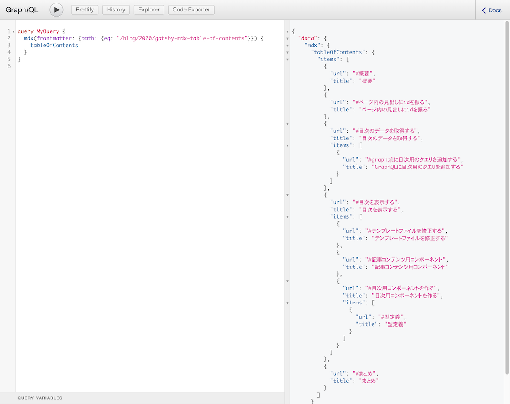

# はじめに
ブログに目次を追加したので、実装方法を残しておきます。
データソースがMDXで`gatsby-plugin-mdx`を使っている前提の記事となっています。

# ページ内の見出しにidを振る
まず、ページ内リンク用に見出しごとのidが必要です。
以下のプラグインで対応しました。
[gatsby-remark-autolink-headers](https://www.gatsbyjs.org/packages/gatsby-remark-autolink-headers/)

>Note: if you are using gatsby-remark-prismjs, make sure that it’s listed after this plugin. Otherwise, you might face an issue described here: https://github.com/gatsbyjs/gatsby/issues/5764.

[gatsby-remark-autolink-headers | GatsbyJS#How to use](https://www.gatsbyjs.org/packages/gatsby-remark-autolink-headers/)

とのことなので、`gatsby-remark-prismjs`を使っている場合は、`gatsby-remark-autolink-headers`の後に記述。
```js:title=gatsby-config.js
module.exports = {
  ...
  plugins: [
    ...
    {
      resolve: `gatsby-plugin-mdx`,
      options: {
        extensions: [`.mdx`, `.md`],
        defaultLayouts: {
          default: require.resolve("./src/components/Layout.tsx"),
        },
        gatsbyRemarkPlugins: [
          ...
          `gatsby-remark-autolink-headers`,
          `gatsby-remark-code-titles`,
          {
            resolve: `gatsby-remark-prismjs`,
            options: {
              classPrefix: "language-",
              inlineCodeMarker: true,
              aliases: {},
              showLineNumbers: true,
              noInlineHighlight: false,
            },
          },
        ],
      },
    },
  ],
};
```


# 目次のデータを取得する
目次のデータをGraphQLで取得する必要があります。実際に取得してみます。

## GraphQLに目次用のクエリを追加する
`gatsby-plugin-mdx`を使っているので、クエリに`tableOfContents`を追加すればデータを取得できます。

```graphql
query BlogPost($path: String) {
  mdx(frontmatter: { path: { eq: $path } }) {
    tableOfContents
  }
}
```

[http://localhost:8000/___graphql](http://localhost:8000/___graphql)にアクセスするとGraphiQLが使えるので確認してみます。
以下のように、目次のデータが取得できていることが確認できました。


# 目次を表示する
目次のデータが取得できたので、UIに落としこみ表示させてみます。

## テンプレートファイルを修正する
テンプレートファイルでクエリを投げて、取得したデータを目次用のコンポーネントにPropsで渡します。

```ts:title=src/templates/blog-post.tsx
import * as React from "react";
import { graphql, PageProps } from "gatsby";
import SEO from "../components/Seo";
import Layout from "../components/Layout";
import Post from "../components/Post";
import { BlogPostQuery } from "../../types/graphql-types";
import { BlogPostPageContext } from "../gatsby-node";

export type Props = PageProps<BlogPostQuery, BlogPostPageContext>;

const BlogPostTemplate: React.FC<Props> = ({ data, pageContext }) => {
  const { body, tableOfContents, frontmatter } = data.mdx;　// highlight-line

  return (
    <Layout pageType={"post"}>
      <SEO title={frontmatter.title} description={frontmatter.description} />
      <Post
        body={body}
        tableOfContents={tableOfContents}　// highlight-line
        frontmatter={frontmatter}
        pageContext={pageContext}
      />
    </Layout>
  );
};

export default BlogPostTemplate;

export const pageQuery = graphql`
  query BlogPost($path: String) {
    mdx(frontmatter: { path: { eq: $path } }) {
      body
      tableOfContents // highlight-line
      frontmatter {
        title
        date
        tags
        path
        description
      }
    }
  }
`;
```

## 記事コンテンツ用コンポーネント
目次表示用の`Toc`コンポーネントに、`tableOfContents.items`の配列を渡しています。
※emotionによるCSSの記述は省略しています。
```tsx:title=src/components/Post.tsx
import * as React from "react";
import { css } from "@emotion/core";
import tw from "twin.macro";
import { MDXRenderer } from "gatsby-plugin-mdx";
import media from "../styles/customMediaQuery";
import Navigation from "./Navigation";
import PostTagList from "./PostTagList";
import Share from "./Share";
import Toc from "./Toc";
import { Maybe, MdxFrontmatter, Scalars } from "../../types/graphql-types";
import { BlogPostPageContext } from "../gatsby-node";

type Props = {
  body?: Scalars["String"];
  tableOfContents: Maybe<Scalars["JSON"]>;
  frontmatter?: Maybe<MdxFrontmatter>;
  pageContext: BlogPostPageContext;
};

const Post: React.FC<Props> = ({
  body,
  tableOfContents,
  frontmatter,
  pageContext,
}) => {
  const { title, date, tags, path } = frontmatter;
  const previousPost = pageContext.previous;
  const nextPost = pageContext.next;
  const previousPagePath = previousPost && previousPost.frontmatter.path;
  const previousLabel = previousPost && previousPost.frontmatter.title;
  const nextPagePath = nextPost && nextPost.frontmatter.path;
  const nextLabel = nextPost && nextPost.frontmatter.title;
  const isBrowser = typeof window !== `undefined`;

  return (
    <>
      <p css={titleText}>{title}</p>
      <p css={dateText}>{date}</p>
      <PostTagList tags={tags} />
      <div css={postWrap}>
        <Toc tableOfContents={tableOfContents.items} />
        <div css={post} className="post">
          <MDXRenderer>{body}</MDXRenderer>
        </div>
      </div>

      <Share
        url={isBrowser ? `${location.origin}${path}` : ""}
        title={title}
        tags={tags}
      />
      <Navigation
        previousPagePath={previousPagePath}
        previousLabel={previousLabel}
        nextPagePath={nextPagePath}
        nextLabel={nextLabel}
      />
    </>
  );
};

export default Post;
```

## 目次用コンポーネントを作る
Propsで渡された目次用のデータは下記のように任意の階層でネストされた構造となっているので、Reactで再帰的にレンダリングさせてみます。

```json
[
  {
    "url": "#概要",
    "title": "概要"
  },
  {
    "url": "#初期設定",
    "title": "初期設定",
    "items": [
      {
        "url": "#自動セットアップで加えられる変更",
        "title": "自動セットアップで加えられる変更"
      }
    ]
  },
  {
    "url": "#ストーリーをtypescriptで書けるようにする",
    "title": "ストーリーをTypeScriptで書けるようにする",
    "items": [
      {
        "url": "#ストーリーを追加して確認してみる",
        "title": "ストーリーを追加して確認してみる"
      }
    ]
  },
  {
    "url": "#グローバルなscssを読み込む",
    "title": "グローバルなSCSSを読み込む"
  },
  {
    "url": "#composition-apiに対応する",
    "title": "Composition APIに対応する"
  },
  {
    "url": "#headに任意のタグを追加したい",
    "title": "headに任意のタグを追加したい"
  },
  {
    "url": "#静的ファイルを読み込みたい",
    "title": "静的ファイルを読み込みたい"
  },
  {
    "url": "#まとめ",
    "title": "まとめ"
  }
]
```

`Items`の中で自身を再帰的にレンダリングしています。
mapで処理中の値（itemという名前のオブジェクト）が`items`を持っていれば再帰的にレンダリングするようになっています。階層が深くなりがちなメニューとかにも使えそう。
※emotionによるCSSの記述は省略しています。

```tsx:title=src/components/Toc.tsx
import * as React from "react";
import { css } from "@emotion/core";
import tw from "twin.macro";
import media from "../styles/customMediaQuery";

type Props = {
  tableOfContents: TocItems[];
};

type TocItems = {
  url: string;
  title: string;
  items?: TocItems[];
};

const Items: React.FC<{ tableOfContents: TocItems[]; depth: number }> = ({
  tableOfContents,
  depth,
}) => {
  return (
    <ul css={list}>
      {tableOfContents.map((item) => (
        <li
          css={listItem}
          key={item.url}
          style={{
            paddingLeft: depth !== 0 ? "1em" : "0",
          }}
        >
          <a href={item.url}>{item.title}</a>
          {item.items && (
            <Items tableOfContents={item.items} depth={depth + 1} /> // highlight-line
          )}
        </li>
      ))}
    </ul>
  );
};

const Toc: React.FC<Props> = ({ tableOfContents }) => {
  return (
    <div css={toc}>
      <h3 css={heading}>Table of Contents</h3>
      <Items tableOfContents={tableOfContents} depth={0} />
    </div>
  );
};

export default Toc;
```
### 型定義
TypeScript 3.7から再帰的なType Aliasesの定義が可能になったので、以下のように定義しています。
[TypeScript: Handbook - TypeScript 3.7#(More) Recursive Type Aliases](https://www.typescriptlang.org/docs/handbook/release-notes/typescript-3-7.html#more-recursive-type-aliases)

```ts
type TocItems = {
  url: string;
  title: string;
  items?: TocItems[];
};
```

# まとめ
`gatsby-transformer-remark`だと`tableOfContents`のクエリでhtmlのタグが取得できたと思うが、`gatsby-plugin-mdx`だと配列で返ってきたのでコンポーネントを作ることになった。
Reactで初めてコンポーネントの再帰処理を書いた。

実際のコードはこちら。
https://github.com/dnrsm/blog


