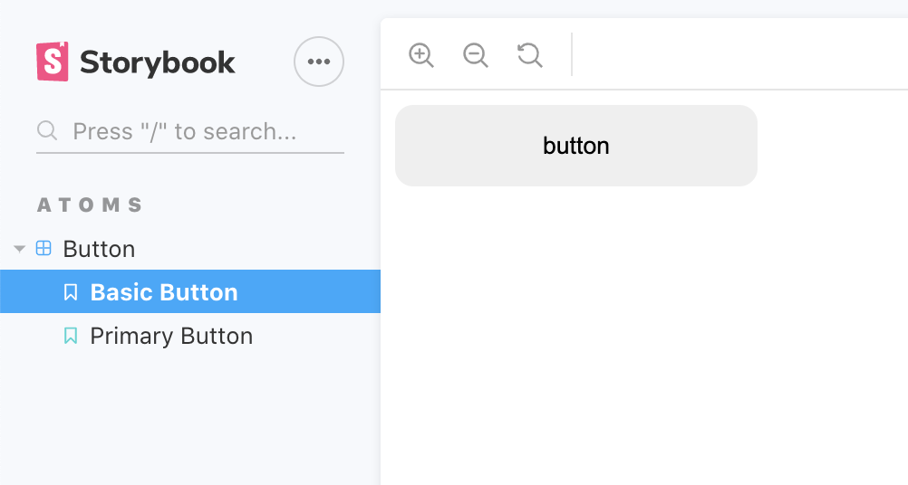

# 概要
Vue + Composition API + TypeScript + WebpackなプロジェクトでStorybookを構築する機会があったのでメモとして残しておく。

# 初期設定
以下の公式ガイドを参考に今回は自動セットアップで構築した。
[Storybook for Vue](https://storybook.js.org/docs/guides/guide-vue)

以下のコマンドを叩けばStorybookを実行できるまでの初期設定が完了する。
```shell
npx -p @storybook/cli sb init --type vue
```

## 自動セットアップで加えられる変更
`package.json`に以下の変更が加えられる。
npmスクリプトと依存関係が追加される。

```json:title=package.json
{
  ...
  "scripts": {
    ...
    "storybook": "start-storybook -p 6006",
    "build-storybook": "build-storybook"
  },
  ...
  "devDependencies": {
    ...
    "@babel/core": "^7.10.3",
    "@storybook/addon-actions": "^5.3.19",
    "@storybook/addon-links": "^5.3.19",
    "@storybook/addons": "^5.3.19",
    "@storybook/vue": "^5.3.19",
    ...
  },
  ...
}
```

`.storybook`と`stories`ディレクトリが追加される。

```shell=
.storybook
└── main.js
stories
├── 0-Welcome.stories.js
├── 1-Button.stories.js
├── MyButton.js
└── Welcome.js
```
`yarn storybook`を叩くとStorybookが起動する。
`yarn build-storybook`を叩くとStorybookを静的なアプリとして書き出せる。
デフォルトだと`storybook-static`ディレクトリに出力される。
出力先を変えたいなら以下のようにする。

```json:title=package.json
"scripts": {
  "build-storybook": "build-storybook -o out"
},
```
他のCLIオプションは以下を参考に。
https://storybook.js.org/docs/configurations/cli-options/

# ストーリーをTypeScriptで書けるようにする
ガイドを参考に`.storybook/main.js`を修正します。
import時のaliasとts-loaderの設定を追加します。
[Custom Webpack Config](https://storybook.js.org/docs/configurations/custom-webpack-config/)
```js:title=.storybook/main.js
const path = require('path');

module.exports = {
  stories: ['../stories/**/*.stories.ts'],
  addons: ['@storybook/addon-actions', '@storybook/addon-links'],
  webpackFinal: (config) => {
    config.resolve = {
      extensions: ['.ts', '.js'],
      alias: {
        "@": path.join(__dirname, "../js/"),
        vue$: "vue/dist/vue.esm.js" // 'vue/dist/vue.common.js' for webpack 1
      }
    };
    config.module.rules.push({ // TypeScriptに対応する
      test: /\.ts$/,
      exclude: /node_modules/,
      use: [
        {
          loader: 'ts-loader',
          options: {
            appendTsSuffixTo: [/\.vue$/],
            transpileOnly: true
          },
        }
      ],
    });
    return config
  },
};
```

プロジェクトのWebpackの構成を再利用したい場合は、Storybookの構成にインポートしてマージすることもできる。
[Custom Webpack Config#Using Your Existing Config](https://storybook.js.org/docs/configurations/custom-webpack-config/#using-your-existing-config)

## ストーリーを追加して確認してみる
```TypeScript:title=stories/atom/Btn.stories.ts
import Button from "@/components/atoms/Button.vue";

export default {
  title: 'Atoms|Button'
};

export const BasicButton = () => ({
  components: { Button },
  template: '<Button/>',
});

export const PrimaryButton = () => ({
  components: { Button },
  template: '<Button :primary="true" />'
});
```

ちゃんと表示されればOK。



# グローバルなSCSSを読み込む
`.storybook/Decorator.vue`を作成して以下のようにする。
`<style lang="scss">`に読み込ませたいSCSSをimportする。

```html:title=.storybook/Decorator.vue
<template>
  <div class='decoarator'>
    <slot name='story'></slot>
  </div>
</template>
<script>
  export default {
    name: 'Decorator'
  }
</script>

<style lang="scss">
@import "@/styles/global.scss";
</style>
```

`.storybook/config.js`を作成し、以下のようにする。
```javascript:title=.storybook/config.js
import { addDecorator } from '@storybook/vue';
import Decorator from './Decorator.vue';

addDecorator(() => ({
  components: { Decorator },
  template: `<decorator><story slot="story" /></decorator>`
}));
```

`.storybook/main.js`に以下を追加します。
```js:title=.storybook/main.js
module.exports = {
  webpackFinal: (config) => {
    ...
    config.module.rules.push({
      test: /\.scss$/,    
      loaders: ['style-loader', 'css-loader', 'sass-loader']
    });
    config.module.rules.push({ // 変数などをまとめたファイルをwebpackで読み込むようにしていたのでこっちにも追加
      test: /\.(css|scss)$/,
      use: [
        {
          loader: "sass-resources-loader",
          options: {
            resources: [path.resolve(__dirname, "../sass/_vars.scss")]
          }
        }
      ]
    });
    ...
  },
};
```

# Composition APIに対応する
`.storybook/config.js`に以下を追加。これだけ。

```javascript:title=.storybook/config.js
import Vue from 'vue'
import VueCompositionApi from '@vue/composition-api'
Vue.use(VueCompositionApi)
```

# headに任意のタグを追加したい
外部のJSとかCSSを読み込みたかったのでheadタグに追加できるように設定した。
`.storybook`に`preview-head.html`を追加して、以下のように記述すればOK。
[Add Custom Head Tags](https://storybook.js.org/docs/configurations/add-custom-head-tags/)

```html:title=.storybook/preview-head.html
<link rel="stylesheet" href="https://hoge.com/hoge.css">
<script src="https://hoge.com/hoge.js"></script>
```

# 静的ファイルを読み込みたい

`/static/images/hoge.png`の画像を下記のように読み込んでいるとする。
```html

```

静的ファイルのディレクトリの起点をCLIのオプション(`-s, --static-dir <dir-names>`)で設定する。
```json:title=package.json
"scripts": {
  "storybook": "start-storybook -s ./static -p 6006",
},
```

# まとめ
既存コンポーネントをストーリーとして追加することまではできた。
追加したアドオンなどについてもそのうち書く。
初期構築から細かい設定まですることで挙動やコツとかの理解が多少進んだ。