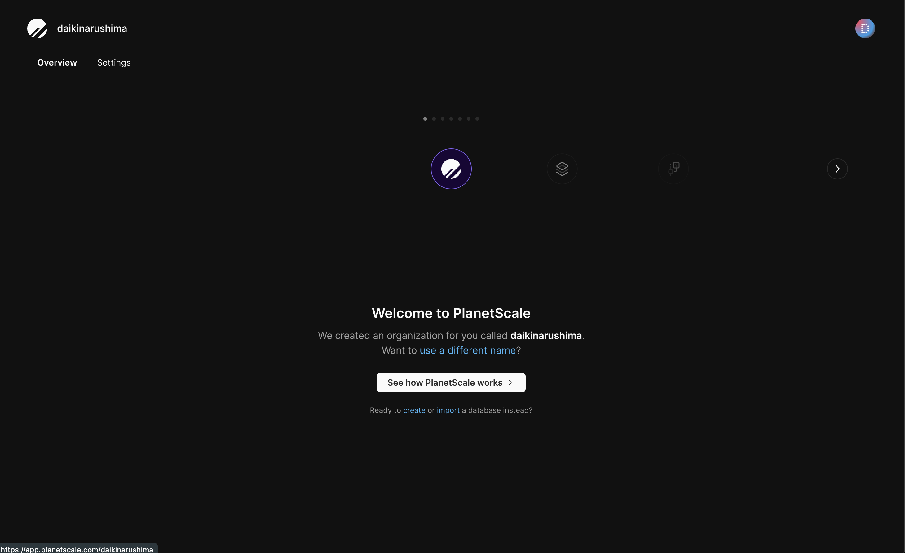
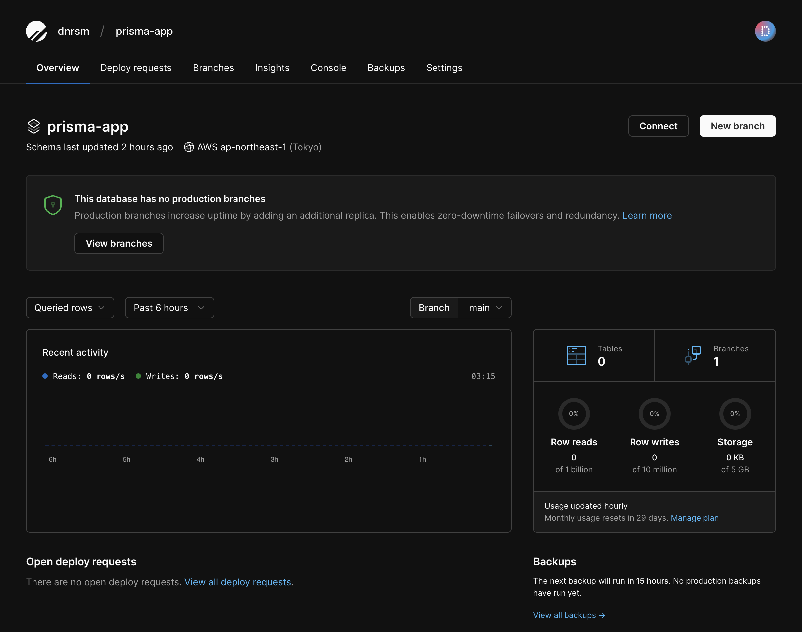
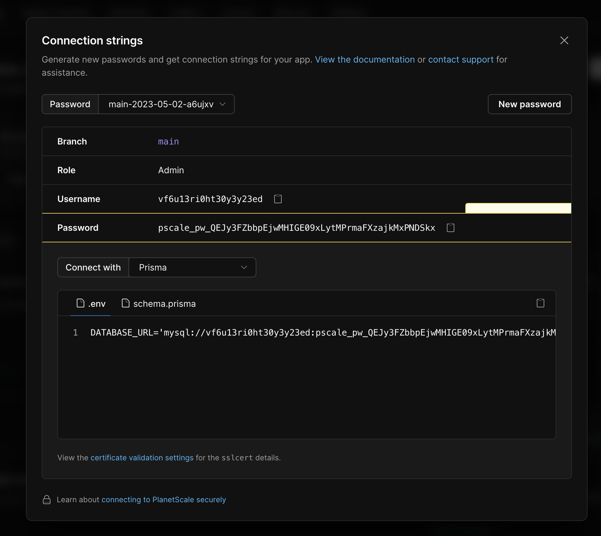
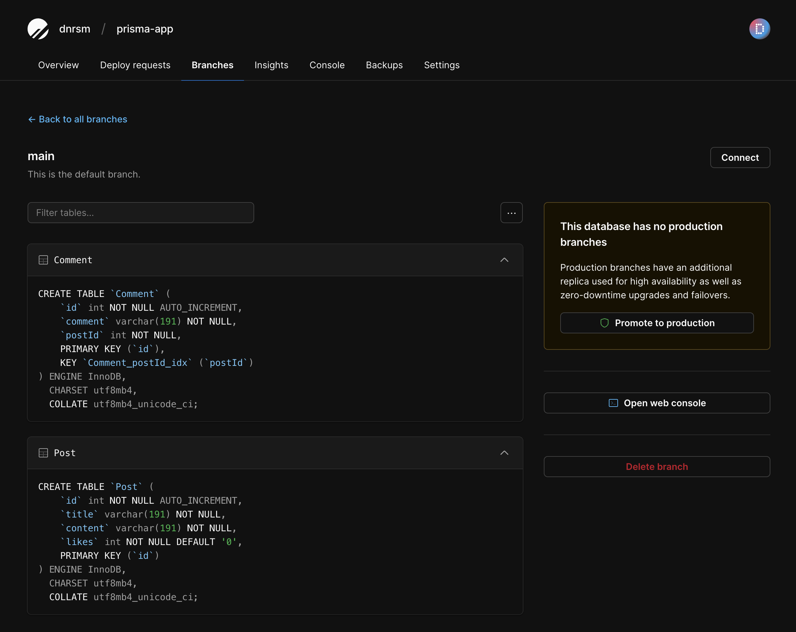
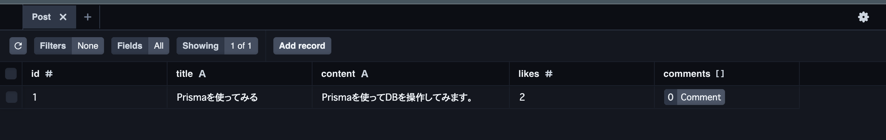

import LinkCard from "../../../components/LinkCard";

# 概要

PlanetScale + Prisma + Next.js 13 で簡単サーバーレスを試してみる

今回の検証で使うライブラリのバージョンを以下のとおり。

- Next.js
  - 13.3.4
- React
  - 18.2.0
- TypeScript
  - 5.0.4
- Prisma
  - 4.13.0

Prisma の公式ドキュメントにもガイドがある。

<LinkCard url="https://www.prisma.io/planetscale" />
<LinkCard url="https://www.prisma.io/docs/guides/database/planetscale" />
<LinkCard url="https://www.prisma.io/nextjs" />
<LinkCard url="https://dev.to/franciscomendes10866" />
<LinkCard url="https://dev.to/franciscomendes10866/build-a-full-stack-app-with-nextjs-tailwind-trpc-and-prisma-orm-4ail" />

PlanetScale の公式ドキュメントにもガイドがある。
https://planetscale.com/docs/prisma/automatic-prisma-migrations

# PlanetScaleの設定

まずはアカウントの作成。



prisma-app という DB を作成。



## PlanetScale で connect

Connect with で Prisma を選択。

Prisma の設定用の `.env` と `schema.prisma` のコードが出てくるので、[Prisma をセットアップ](/blog/2023/planet-scale-prisma-nextjs#prisma-%E3%81%AE%E5%88%9D%E6%9C%9F%E3%82%BB%E3%83%83%E3%83%88%E3%82%A2%E3%83%83%E3%83%97)するときに自動で追加されるファイルにそのままコピペする。



# Next.jsのセットアップ

今回は Next.js で試してるので、プロジェクトを作成する。

```shell
$ yarn create next-app --typescript next-prisma-app
```

Next.js 13 から beta 版で使えるようになった [App Directory](https://beta.nextjs.org/docs/app-directory-roadmap) を試してみたいので、以下には Yes を選択する。

```shell
? Would you like to use experimental `app/` directory with this project? › No / Yes
```

すると、`next.config.js` に設定が追加されるので、これで App Directory が使えるようになる。

```js:title=next.config.js
/** @type {import('next').NextConfig} */
const nextConfig = {
  experimental: {
    appDir: true,
  },
}

module.exports = nextConfig
```

<LinkCard url="https://beta.nextjs.org/docs/app-directory-roadmap" />

# Prismaの導入

Next.js で使うライブラリをインストールする。

```shell
$ yarn add -D prisma
```

```shell
$ yarn add @prisma/client
```

## Prisma の初期セットアップ。

```shell
$ npx prisma init
```

以下のファイルが自動生成される。

- `.env`
- `prisma/schema.prisma`

`.env` を `.gitignore` に追加する。

VS code の拡張機能をインストールする。

<LinkCard url="https://marketplace.visualstudio.com/items?itemName=Prisma.prisma" />

## 設定ファイルの編集

Connect with で Prisma を選択。

`.env` と `schema.prisma` 用のコードが出てくるので、先ほど自動で追加されたファイルにそのままコピペする。

## Model の追加

DB の Model を追加してみる。

```ts
model Post {
  id       Int       @id @default(autoincrement())
  title    String
  content  String
  likes    Int       @default(0)
  comments Comment[]
}

model Comment {
  id      Int    @id @default(autoincrement())
  comment String
  postId  Int
  post    Post   @relation(fields: [postId], references: [id], onDelete: Cascade)

  @@index([postId])
}
```

`npx prisma db push` で DB に反映する。

実際には `yarn db:push` というコマンドを作っている。

```json:title=package.json
{
  "scripts": {
    "db:push": "prisma db push"
  }
}
```

成功。

```shell
$ prisma db push
Environment variables loaded from .env
Prisma schema loaded from prisma/schema.prisma
Datasource "db": MySQL database "prisma-app" at "aws.connect.psdb.cloud"

🚀  Your database is now in sync with your Prisma schema. Done in 1.14s

✔ Generated Prisma Client (4.13.0 | library) to ./node_modules/@prisma/client in 39ms

✨  Done in 3.46s.
```

### PlanetScale で確認

ちゃんとスキーマが反映されている。



## Prisma StudioでDBにダミーデータを追加をする

Prisma には [Prisma Studio](https://www.prisma.io/studio) というローカルからデータベースを操作できる GUI のエディターが提供されている。
`npx prisma studio` を実行すると http://localhost:5555 で起動する。

試しに適当なデータを入れてみる。



<LinkCard url="https://www.prisma.io/studio" />

# フロントから DB 操作する

## Server Componentで取得する

App Directory では Server components がデフォルトになっているので、まずはコンポーネント内で prisma を使い直接取得してみる。
Next.js 12 までは SSR でデータ取得する際には `getServerSideProps` を使っていたが、RFC のコンポーネントレベルでの `async`/`await` が使えるようになったので、以下のように直接的に書ける。

```tsx:title=src/app/posts/page.tsx
import type { Post } from "@prisma/client";
import { PrismaClient } from "@prisma/client";

async function getPosts() {
  const prisma = new PrismaClient();
  const posts: Post[] = await prisma.post.findMany();
  return posts;
}

export default async function Posts() {
  const posts = await getPosts();

  return (
    <main>
      <ul>
        {posts.map((post) => (
          <li key={post.id}>
            <p>title: {post.title}</p>
            <p>content: {post.content}</p>
            <p>likes: {post.likes}</p>
          </li>
        ))}
      </ul>
    </main>
  );
}
```

また、少しネタが古いが、Next.js が `fetch` を拡張して独自の cache 設定ができるようになっているので、これまでの getStaticProps や getServerSideProps は fetch の cache オプションで表現できる。

<LinkCard url="https://nextjs.org/blog/next-13#new-app-directory-beta" />
<LinkCard url="https://beta.nextjs.org/docs/rendering/server-and-client-components#server-components" />

## API routeから取得する

Next.js 13.2 からは Custom Route Handlers が追加されたので、それに倣って API を作ってみる。

<LinkCard url="https://nextjs.org/blog/next-13-2#custom-route-handlers" />

Custom Route Handlers は app ディレクトリ内に `routes.js|ts` で定義すると使える。
`GET`, `POST`, `PUT`, `PATCH`, `DELETE`, `HEAD`, `OPTIONS` の HTTP メソッドに対応していて、このメソッド名で定義された関数を export すると、そのメソッドの API を作ることができる。

<LinkCard url="https://beta.nextjs.org/docs/api-reference/file-conventions/route" />

今回は特にパラメータなどを受け取らない静的ルートの API を実装してみる。
prisma を使って post テーブルから取得した一覧を返す実装は以下のようになる。

```ts:title=src/app/api/posts/route.ts
import { prisma } from "@/lib/prisma";
import { NextResponse } from "next/server";

export async function GET() {
  const posts = await prisma.post.findMany();
  return NextResponse.json({ posts });
}
```

## Client Componentで取得する

一覧を取得できる API が出来たので、今度は Client Component でデータ取得をしてみる。
`"use client"` ディレクティブを使うと client-side で実行されるコードを書くことができる。

<LinkCard url="https://beta.nextjs.org/docs/rendering/server-and-client-components#client-components" />

実際に `"use client"` を使ったコンポーネントを実装する。
Next.js 13 からは `use` も追加されたので、お試しで使ってみる。
ただ、注意点として、公式ドキュメントによると `fetch` をラップした `use` は複数の再レンダリングを誘発する可能性があるとのことで、[SWR](https://swr.vercel.app/ja)や[TanStack Query(React Query)](https://tanstack.com/query/latest)が推奨されている。

<LinkCard url="https://beta.nextjs.org/docs/data-fetching/fetching#use-in-client-components" />

実際に API から取得するコンポーネントの実装。

```tsx:title=src/components/Posts.tsx
"use client";

import { Post } from "@prisma/client";
import { use } from "react";

const getPosts = async () => {
  const res = await fetch(`http://localhost:3000/api/posts`);
  const data = await res.json();
  return data as Post[];
};

export default function Posts() {
  const posts = use(getPosts());

  return (
    <ul>
      {posts.map((post) => (
        <li key={post.id}>
          <p>title: {post.title}</p>
          <p>content: {post.content}</p>
          <p>likes: {post.likes}</p>
        </li>
      ))}
    </ul>
  );
}
```

```tsx:title=src/app/posts/page.tsx
import { Suspense } from "react";
import Posts from "@/components/Posts";

export default function PostsPage() {
  return (
    <Suspense fallback={<p>Loading...</p>}>
      <Posts />
    </Suspense>
  );
}
```

<LinkCard url="https://beta.nextjs.org/docs/routing/route-handlers" />

## 動的ルートから取得する

詳細ページなどで個別の動的なデータを取得する場合は、動的ルートの API を作る必要がある。
今回は、`/api/posts/[id]`のようにパスパラメータで取得できるエンドポイントを作ってみる。
`params` からディレクトリ名（`[id]`）に指定した id の値を取得できるようなので、それを使って prisma 経由でデータを取得するとこんな感じ。

```ts:title=src/app/api/posts/[id]/route.ts
import { prisma } from "@/lib/prisma";
import { NextResponse } from "next/server";

export async function GET(
  _req: Request,
  { params }: { params: { id: string } }
) {
  const post = await prisma.post.findUnique({
    where: {
      id: Number(params.id),
    },
  });

  if (post === null) {
    return new NextResponse(null, { status: 404 });
  }

  return NextResponse.json(post);
}
```

コンポーネントからも `params` からディレクトリ名（`[id]`）に指定した id の値を取得できるので、それをエンドポイントのパスパラメータに指定して取得する。
Server Component として実装すると以下のような感じになる。

```tsx:title=src/app/posts/[id]/page.tsx
import type { Post } from "@prisma/client";

async function getPost(id: string) {
  const res = await fetch(`http://localhost:3000/api/posts/${id}`, {
    next: { revalidate: 60 },
  });

  const data = await res.json();
  return data as Post;
}

export default async function PostPage({ params }: { params: { id: string } }) {
  const post = await getPost(params.id);

  return (
    <main>
      <p>title: {post.title}</p>
      <p>content: {post.content}</p>
      <p>likes: {post.likes}</p>
    </main>
  );
}
```

## データを作成する

一覧取得時に実装した `/api/posts` のエンドポイントに POST 用の関数を追加する。
`prisma` の `create` でデータを作成する。

```ts:title=src/app/api/posts/route.ts
...
export async function POST(request: Request) {
  const data = await request.json();

  const post = await prisma.post.create({
    data: { title: data.title, content: data.content },
  });

  return new NextResponse(`${post.id}`, { status: 201 });
}
```
